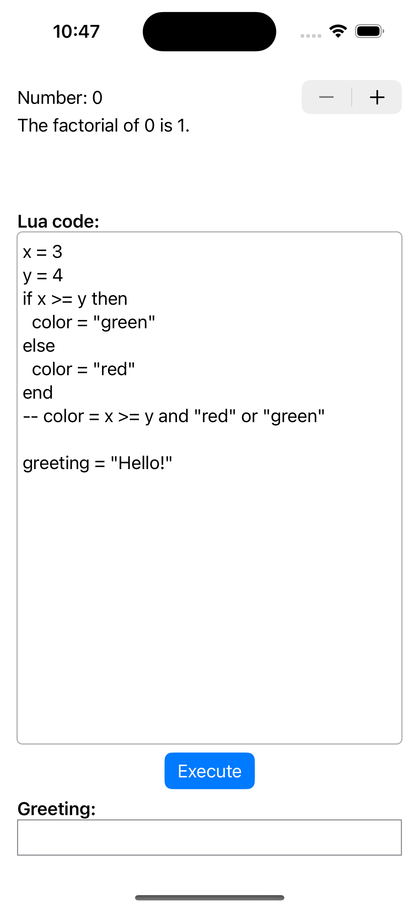

# SwiftUICallsC

This is a SwiftUI app that demonstrates:

- defining and calling C functions in a SwiftUI project
- embedding the Lua interpreter in a SwiftUI app
- enabling users to enter and execute Lua code
- updating the UI based on data obtained from Lua global variables

For information about Lua and embedding it in C applications,
see my blog page on [Lua](https://mvolkmann.github.io/blog/topics/#/blog/lua/).

For information about calling C code from Swift, see my blog page
[Calling C](https://mvolkmann.github.io/blog/topics/#/blog/swift/CallingC/).
